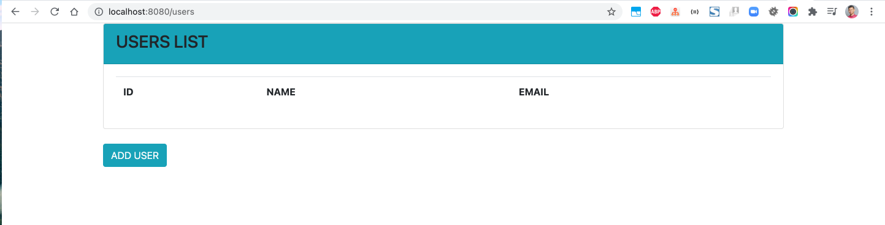
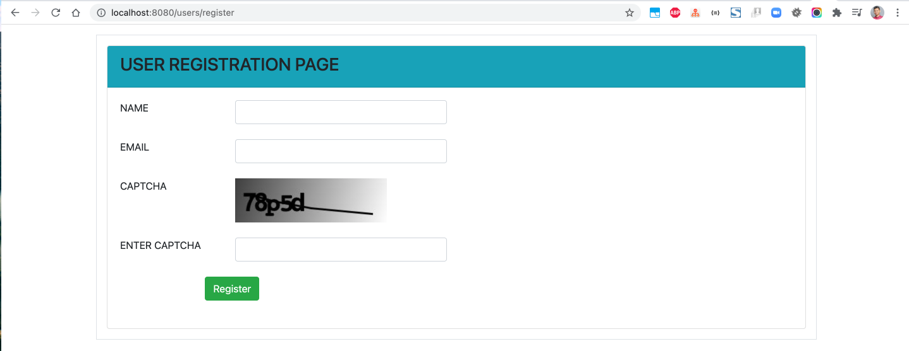
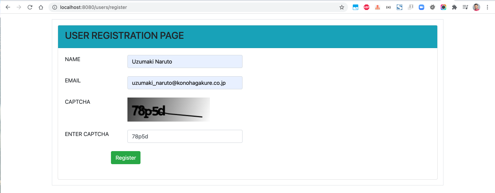
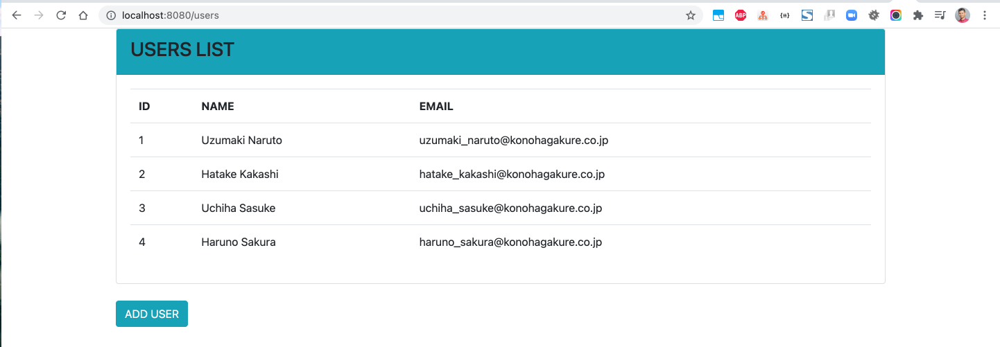
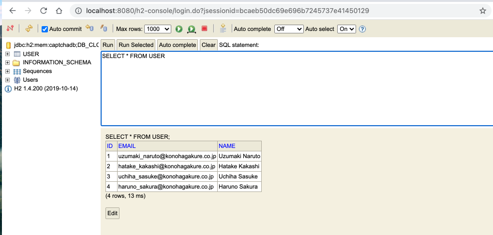

# spring-boot-recaptcha-demo1

### Things todo list

1. Clone this repository: `git clone https://github.com/hendisantika/spring-boot-recaptcha-demo1.git`
2. Navigate to the folder: `cd spring-boot-recaptcha-demo1`
3. Run the application: `mvn clean spring-boot:run`
4. Open your favorite browser: http://localhost:8080/users

### Images Screen shot

Users List Page

Register New User Page

H2 In-Memory DB

